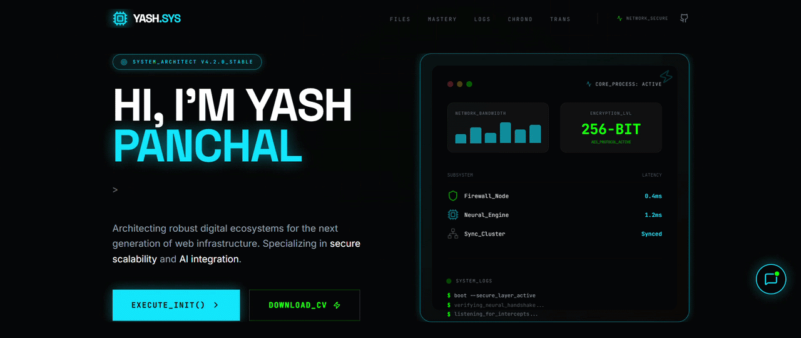

# ⚡ Yash Portfolio: Cyber-Tech Identity ⚡

<p align="center">
  
</p>

> **A high-performance, futuristic portfolio ecosystem engineered for the digital age.**

Built with a modular architecture using **React 19**, **Vite 6**, and **Tailwind CSS 4**. This platform features a high-fidelity cyberpunk aesthetic, neon-glow interfaces, and liquid-smooth animations to showcase technical mastery in development and cybersecurity.

---

## 🌐 Live Transmission
**[DEPLOYMENT_LINK](https://ais-pre-ciqchn2rtvfsta3jqza7no-627196256439.asia-southeast1.run.app)**

---

## 🛠️ Tech Stack & Infrastructure

| Layer | Technology | Purpose |
| :--- | :--- | :--- |
| **Frontend** | `React 19` + `Vite 6` | High-performance SPA with modular architecture |
| **Backend** | `Node.js` + `Express` | Scalable API gateway & AI service orchestration |
| **Styling** | `Tailwind CSS 4` | Utility-first CSS with next-gen performance |
| **Motion** | `motion/react` | Production-ready motion library for React |
| **Intelligence** | `Gemini API` | Generative AI integrations for chatbot & analysis |
| **Environment** | `TypeScript` | Type-safe development across the entire stack |

---

## ✨ Core Protocols (Features)

### 🖥️ Futuristic Terminal UI
Custom-engineered design utilizing glassmorphism, scanner effects, and neon-variable color palettes. Optimized for high-density information display while maintaining a clean, premium aesthetic.

### 🤖 AI Intelligence (ChatBot)
Integrated Generative AI assistant powered by a dedicated Express backend and Gemini API, capable of responding to technical inquiries, experience verification, and project breakdowns in real-time.

### 🍱 Advanced Project Registry
A dynamic showcase featuring:
- **Category Matrix**: Real-time filtering by tech stack.
- **Dynamic Previews**: Multi-image slideshows for complex dashboard projects.
- **Scanner Animations**: Hover-triggered data-read effects.

### 📨 Professional Transmission Gateway
Full-stack contact gateway with backend validation, security middlewares, and automated routing via `EmailJS` and custom server logic.

---

## 🚀 Deployment & Setup

### Protocol 01: Environment Initialization
Ensure you have [Node.js](https://nodejs.org/) installed on your mainframe.

```bash
# Clone the repository
git clone https://github.com/yspanchal6/portfolio.git

# Enter the directory
cd portfolio

# Install dependencies (Unified package)
npm install
```

### Protocol 02: Launching Local Hub (Full-Stack)
```bash
npm run dev
```
The application hub will be broadcasted on `http://localhost:3000`. This launches both the **Express Server** and the **Vite Development Middleware**.

### Protocol 03: Production Compilation
```bash
npm run build
```
Generates a specialized production bundle inside `dist/`, including a bundled `server.cjs` for seamless deployment.

---

## 🔐 Security & Configuration

To enable the Secure Contact Protocol, configure your `.env` file:

```env
# EmailJS Integration
SERVICE_ID=your_service_id
TEMPLATE_ID=your_template_id
PUBLIC_KEY=your_public_key

# Generative AI (Gemini)
GEMINI_API_KEY=your_gemini_key
```

---

## 📂 Project Architecture

The project follows a **Professional Mono-Repo Style** structure, strictly separating concerns while sharing global configurations.

```text
root/
│
├── client/                 # Frontend Architecture (Vite + React)
│   ├── public/             # Static Assets
│   │   ├── images/         # Portfolio & Project images
│   │   └── resume/         # Academic & Professional CVs
│   ├── src/
│   │   ├── animations/     # Framer Motion & CSS keyframes
│   │   ├── assets/         # Local static assets
│   │   ├── components/     # Reusable UI (common, ui, layout)
│   │   ├── hooks/          # Custom React hooks
│   │   ├── sections/       # Viewport-specific page sections
│   │   ├── services/       # External service integrations
│   │   ├── api/            # Client-side API definitions
│   │   ├── styles/         # Tailwind CSS & Global themes
│   │   ├── types/          # TypeScript interfaces/enums
│   │   └── utils/          # Helper functions & utilities
│   ├── App.tsx             # Root Application Component
│   ├── main.tsx            # Runtime Entry Point
│   └── index.html          # HTML Blueprint
│
├── server/                 # Backend Architecture (Node.js + Express)
│   ├── src/
│   │   ├── chatbot/        # AI logic & Gemini Orchestration
│   │   ├── controllers/    # Request handler logic
│   │   ├── routes/         # API Endpoint definitions
│   │   ├── middleware/     # Security & Validation middlewares
│   │   ├── services/       # Business logic layer
│   │   ├── config/         # Server-side configurations
│   │   ├── database/       # DB Connection (Future MongoDB/Postgres)
│   │   ├── models/         # Data Schema definitions
│   │   └── app.ts          # Primary Server entry
│   └── tsconfig.json       # Backend Type Configuration
│
├── shared/                 # Shared Entities & Isomorphic code
├── docs/                   # System Specs & Architecture Reports
├── vite.config.ts          # Unified Full-stack Build System
└── package.json            # Deployment & dependency manifest
```

---

## 🤝 Contribution Credits
- **Developer**: Yash Panchal
- **Design Inspiration**: Futuristic / Cyberpunk 2077 / Modern Tech Dashboards
- **Tools**:  VS Code, Postman

---

## 📝 License
This project is licensed under the **MIT License**.


